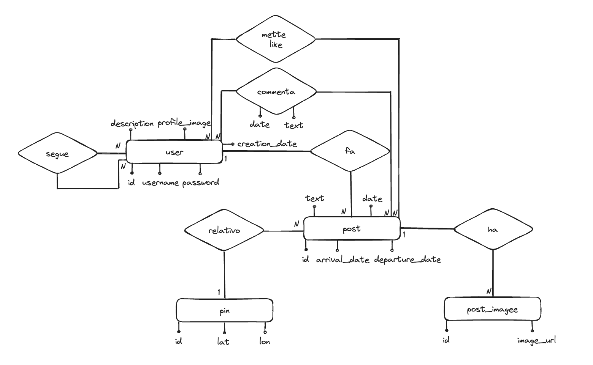

# Relazione Tecnica - City Pin

## Introduzione

**City Pin** nasce dall'idea di creare un social network per condividere i propri viaggi in giro per il mondo. Il suo obiettivo principale è quello di mettere in comunicazione persone con interessi per i viaggi in modo da poter scegliere la prossima meta consultando i post fatti da altri utenti che hanno già visitato quel posto. Per questo motivo ogni utente può creare un post contenente il nome della città, il periodo di permanenza, una piccola descrizione ed eventuali foto. Gli altri utenti possono mettere like al post e scrivere commenti relativi al post. Qualsiasi utente può effettuare ricerche relative ai viaggi di una singola persona, ad un periodo di permanenza o relative ad una specifica città.

## Tecnologie Utilizzate

City Pin utilizza diverse tecnologie, linguaggi di programmazione, framework, librerie e strumenti:

- **Flask**: Un framework leggero per applicazioni web in Python. È utilizzato per gestire il routing delle richieste HTTP e gestire i template HTML.
- **SQLite**: Un motore di database SQL leggero e incorporabile. Utilizzato per memorizzare i dati dell'applicazione, come utenti, post, commenti, etc.
- **Datetime**: Un modulo di Python utilizzato per lavorare con date e orari.
- **Geopy**: Una libreria Python che fornisce accesso ai servizi di geocoding, utilizzata qui per ottenere le coordinate geografiche di una città.
- **bcrypt**: Una libreria di hashing per Python, utilizzata per crittografare le password degli utenti.
- **Jinja2**: Un motore di template per Python, utilizzato con Flask per generare dinamicamente HTML.
- **HTML/CSS/JavaScript**: Linguaggi di markup, stile e scripting utilizzati per creare l'interfaccia utente dell'applicazione web.
- **Visual Studio Code**: Un editor di codice utilizzato per sviluppare.
- **Git**: Un sistema di controllo versione distribuito utilizzato per il controllo del codice sorgente e la collaborazione nello sviluppo del software.
- **Github**: Utilizzato per gestire le user stories, gli issues e il versioning del codice.
- **PythonAnywhere**: Sito dove è stato effettuato il deploy.

## Architettura del Sistema

Componenti principali:

- **Applicazione Flask**: Punto centrale dell'applicazione, gestisce il routing delle richieste HTTP, le visualizzazioni dei template HTML e la logica del sistema.
- **Database SQLite**: Utilizzato per memorizzare i dati dell'applicazione, come utenti, post, commenti, etc.
- **Interfaccia utente (UI)**: L'interfaccia attraverso cui gli utenti interagiscono con l'applicazione, costruita utilizzando HTML, CSS e JavaScript.

Moduli:

- **Flask**: Il modulo principale che fornisce il framework per lo sviluppo dell'applicazione web.
- **SQLite3**: Utilizzato per l'interfacciamento con il database SQLite.
- **Geopy**: Per l'interazione con i servizi di geocoding per ottenere le coordinate geografiche di una città.
- **bcrypt**: Utilizzato per la crittografia delle password degli utenti.
- **Jinja2**: Un motore di template per generare dinamicamente HTML.
- **Datetime**: Utilizzato per gestire date e orari all'interno dell'applicazione.
- **os**: Per l'interazione con il sistema operativo, ad esempio per gestire i percorsi dei file e per salvare le immagini nella rispettiva cartella.

Pattern architetturali utilizzati:

- **Model-View-Controller (MVC)**: L'applicazione segue un modello di progettazione MVC. Flask gestisce il routing delle richieste e il caricamento delle viste (View), i modelli (Model) sono rappresentati dai dati memorizzati nel database SQLite, e la logica di business e il controllo del flusso sono gestiti principalmente dalle funzioni definite nei file Python.
- **Template View Pattern**: Flask utilizza il motore di template Jinja2 per generare dinamicamente HTML. I template HTML contengono marcatori che vengono sostituiti con dati dinamici prima di essere restituiti al client.
- **File System Pattern**: Viene utilizzato per gestire il caricamento e il salvataggio di file sul sistema di file del server, ad esempio per gestire le immagini del profilo degli utenti e le immagini dei post.
- **Stateless Communication**: Poiché HTTP è un protocollo stateless, l'applicazione segue questo principio e non mantiene lo stato delle sessioni utente sul server, ma utilizza sessioni gestite da Flask per tenere traccia dell'autenticazione degli utenti.

## Database



```sql
-- Tabella pins
CREATE TABLE pins (
    id INTEGER PRIMARY KEY,
    lat REAL,
    lon REAL,
    city_id INTEGER,
    FOREIGN KEY (city_id) REFERENCES cities(id)
);

-- Tabella post
CREATE TABLE post (
    id INTEGER PRIMARY KEY,
    pin_id INTEGER,
    user_id INTEGER,
    text TEXT,
    date DATE,
    arrival_date DATE,
    departure_date DATE,
    FOREIGN KEY (pin_id) REFERENCES pins(id),
    FOREIGN KEY (user_id) REFERENCES users(id)
);

-- Tabella comments
CREATE TABLE comments (
    id INTEGER PRIMARY KEY,
    post_id INTEGER,
    user_id INTEGER,
    text TEXT,
    date DATE,
    FOREIGN KEY (post_id) REFERENCES post(id),
    FOREIGN KEY (user_id) REFERENCES users(id)
);

-- Tabella likes
CREATE TABLE likes (
    id INTEGER PRIMARY KEY,
    post_id INTEGER,
    user_id INTEGER,
    FOREIGN KEY (post_id) REFERENCES post(id),
    FOREIGN KEY (user_id) REFERENCES users(id)
);

-- Tabella followers
CREATE TABLE followers (
    id INTEGER PRIMARY KEY,
    user_id INTEGER,
    follower_id INTEGER,
    FOREIGN KEY (user_id) REFERENCES users(id),
    FOREIGN KEY (follower_id) REFERENCES users(id)
);

-- Tabella users
CREATE TABLE users (
    id INTEGER PRIMARY KEY,
    username TEXT,
    password TEXT,
    description TEXT,
    creation_date DATE,
    profile_image TEXT
);

-- Tabella post_images
CREATE TABLE post_images (
    id INTEGER PRIMARY KEY,
    post_id INTEGER,
    image_url TEXT,
    FOREIGN KEY (post_id) REFERENCES post(id)
);
```

## Sviluppo del Software

Per realizzare questo progetto e gestire i suo versioning è stato scelto di utilizzare git e GitHub. Inoltre dal momento che il software è stato sviluppato con VS Code è stato utilizzato il Source Control per effettuare i push, i pull e i commit del progetto.

1. **Creazione del Repository su GitHub**
2. **Clonazione del Repository in Visual Studio Code**
3. **Sviluppo delle Funzionalità**
4. **Commit delle Modifiche**
5. **Push delle Modifiche su GitHub**

[Link repository GitHub](https://github.com/L3o15/CityPin).

## User Stories e Requisiti

1. **Registrazione Utente**:
   - Come utente, voglio poter creare un nuovo account inserendo un nome utente, una password e una descrizione.
   - Come utente, voglio poter caricare un'immagine del profilo durante la registrazione.
2. **Accesso Utente**:
   - Come utente, voglio poter accedere al mio account inserendo il nome utente e la password corretti.
3. **Visualizzazione Profilo Utente**:
   - Come utente, voglio poter visualizzare il mio profilo, inclusi il nome utente, la descrizione e l'immagine del profilo.
   - Come utente, voglio poter visualizzare il numero di follower e il numero di post pubblicati nel mio profilo.
4. **Modifica Profilo Utente**:
   - Come utente, voglio poter modificare il mio nome utente, la descrizione e l'immagine del profilo.
5. **Visualizzazione Profili Altri Utenti**:
   - Come utente, voglio poter visualizzare il profilo di altri utenti, inclusi il loro nome utente, la descrizione e l'immagine del profilo.
   - Come utente, voglio poter vedere il numero di follower e il numero di post pubblicati nel profilo degli altri utenti.
6. **Seguire/Smettere di Seguire un Utente**:
   - Come utente, voglio poter seguire un altro utente.
   - Come utente, voglio poter smettere di seguire un utente che ho già seguito.
7. **Pubblicazione di Post**:
   - Come utente, voglio poter pubblicare un nuovo post, includendo un testo, la data di arrivo e di partenza, e una o più immagini.
8. **Visualizzazione Post**:
   - Come utente, voglio poter visualizzare i post pubblicati da altri utenti, inclusi il testo, la data di pubblicazione, la posizione e le immagini.
9. **Interazione con i Post**:
   - Come utente, voglio poter mettere "mi piace" a un post.
   - Come utente, voglio poter commentare un post.
   - Come utente, voglio poter eliminare un mio post.
10. **Ricerca di Utenti e Post**:
    - Come utente, voglio poter cercare altri utenti inserendo il loro nome utente.
    - Come utente, voglio poter cercare post inserendo una data o una città.

## Documentazione del Codice

Il codice presenta commenti esplicativi che aiutano a comprendere il funzionamento delle diverse parti del programma. Inoltre, per la documentazione delle librerie utilizzate, puoi consultare i seguenti link:

- Flask: [Documentazione di Flask](https://flask.palletsprojects.com/)
- SQLite3: [Documentazione di SQLite3](https://docs.python.org/3/library/sqlite3.html)
- datetime: [Documentazione di datetime](https://docs.python.org/3/library/datetime.html)
- Geopy: [Documentazione di Geopy](https://geopy.readthedocs.io/)
- bcrypt: [Documentazione di bcrypt](https://github.com/pyca/bcrypt/)

## Test e Validazione

Il software è stato sviluppato seguendo le user stories e per ogni user story è stato realizzato il codice necessario alla sua realizzazione testando il funzionamento e il comportamento del sistema nel suo complesso.

## Deploy e Manutenzione

### Configurazione dell'Ambiente di Produzione

1. **Creazione dell'Account su PythonAnywhere**
   - È stata creata un'account su PythonAnywhere per ospitare l'applicazione.

2. **Creazione dell'Ambiente Virtuale**
   - È stata creata un'ambiente virtuale su PythonAnywhere per isolare le dipendenze dell'applicazione.

3. **Caricamento del Codice Sorgente**
   - Il codice sorgente dell'applicazione è stato caricato sul server PythonAnywhere per consentire l'esecuzione dell'applicazione sul server remoto.

### Modifica delle Rotte del File System

1. **Aggiornamento delle Rotte nel Codice Sorgente**
   - Le rotte nel codice dell'applicazione sono state modificate per adattarle alla struttura di directory specifica di PythonAnywhere.
   - Le rotte per il caricamento e il recupero delle immagini sono state aggiornate per puntare alle directory appropriate su PythonAnywhere.

2. **Gestione delle Cartelle di Upload**
   - Le variabili `UPLOAD_FOLDER` e `UPLOAD_FOLDER_POST_IMAGES` sono state configurate per puntare alle directory corrette su PythonAnywhere per il caricamento delle immagini.

### Configurazione del Server Web e delle Variabili di Ambiente

1. **Configurazione del Server Web (WSGI)**
   - Il server web (WSGI) è stato configurato per servire l'applicazione sull'URL desiderato, assicurando che l'applicazione fosse accessibile tramite l'URL specificato.

2. **Utilizzo delle Variabili di Ambiente**
   - Le variabili di ambiente sono state utilizzate per gestire le chiavi segrete, le credenziali del database e altre configurazioni sensibili, garantendo che fossero impostate correttamente su PythonAnywhere.

### Test del Deploy dell'Applicazione

1. **Test dell'Applicazione**
   - Dopo la configurazione, l'applicazione è stata testata per verificare che funzionasse correttamente su PythonAnywhere.
   - Sono stati eseguiti test per garantire che le rotte dell'applicazione funzionassero correttamente e che l'applicazione fosse accessibile agli utenti.

## Conclusioni

Durante lo sviluppo del progetto, sono emerse diverse considerazioni chiave:

### Media Queries

È stato necessario utilizzare le media queries CSS per applicare stili diversi in base alle dimensioni dello schermo, consentendo un layout fluido e una disposizione ottimale degli elementi su dispositivi di diverse dimensioni.

### Sicurezza

È stata posta particolare attenzione alla sicurezza dell'applicazione, implementando l'hashing delle password e l'uso di salt per proteggere le credenziali degli utenti.

### Deployment su PythonAnywhere

Il processo di deploy su PythonAnywhere ha richiesto alcuni aggiustamenti, in particolare nella gestione delle rotte del file system e nella configurazione del server web. Tuttavia, una volta completata la configurazione, l'applicazione è stata eseguita correttamente e resa disponibile agli utenti.

### Testing e Debugging

È stata dedicata una fase significativa allo sviluppo di test e alla risoluzione di bug, garantendo che l'applicazione fosse stabile e funzionante prima del deploy.

### Gestione del Codice

L'uso di un sistema di versionamento come Git ha facilitato la collaborazione e la gestione del codice sorgente tra i membri del team, consentendo una migliore tracciabilità delle modifiche e la gestione dei rami di sviluppo.
